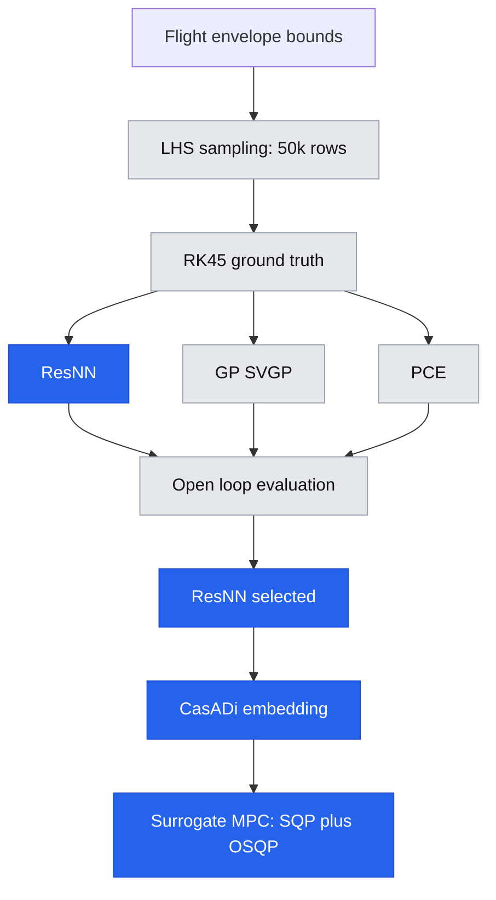

# Surrogate-MPC: Learning-Accelerated Nonlinear MPC for Quadrotor Attitude Control

  

A residual neural network learns the nonlinear correction a hover-linearised quadrotor model misses, gets ported into a CasADi symbolic function, and is embedded directly inside a real-time MPC — aiming for the tracking accuracy of an MPC that uses the true nonlinear dynamics, at a solve time close to a linear MPC's. Benchmarked in closed loop against three baselines that each isolate one design choice: PID (no model), Linearised-MPC (a cheap but wrong model), and ODE-MPC (the true model, at full computational cost).

> Developed as a minor project / thesis submission — IOE, Pulchowk Campus, Tribhuvan University. *(edit or remove this line as appropriate.)*

## Table of contents
- [Overview](#overview)
- [How it works](#how-it-works)
- [The four controllers](#the-four-controllers)
- [Repository structure](#repository-structure)
- [Installation](#installation)
- [Usage](#usage)
- [Outputs](#outputs)
- [Results](#results)
- [Known limitations](#known-limitations)
- [Dependencies](#dependencies)
- [License](#license)
- [Acknowledgments](#acknowledgments)

## Overview

Nonlinear MPC that re-integrates the true dynamics inside the solver at every iteration is accurate but expensive; a fixed linearisation is cheap but drifts as the vehicle moves away from the linearisation point. This project closes that gap with a learned surrogate: rather than approximating the full dynamics, a small network is trained only on the *nonlinear residual* — the part of the one-step state change the linear model gets wrong — so the physics-linear term stays exact by construction and the network only has to learn a correction.

Three candidate surrogate families are trained on the same residual target and compared head to head before any control happens:

- **ResNN** — a small feed-forward network (9→32→32→6, SiLU)
- **GP** — six independent Sparse Variational Gaussian Processes (one per output channel)
- **PCE** — a Polynomial Chaos Expansion, swept across orders 1–5

ResNN is the one carried forward into the controller: its trained weights are re-expressed as a CasADi symbolic function, differentiable end to end, and composed into a fast SQP + OSQP-solved MPC.

## How it works



1. **Data generation** — Latin Hypercube Sampling draws 50,000 (state, input) pairs spanning the full attitude/rate/torque envelope; each is simulated one step forward through the true Newton-Euler ODE (adaptive RK45) to get the resulting state delta.
2. **Three surrogates, one target** — ResNN, GP, and PCE are all trained on `Y − delta_linear(X)`: the residual the hover-linear model doesn't already explain.
3. **Open-loop comparison** — one-step RMSE, 5-second rollout stability, sample-efficiency, and inference latency, computed identically for all three.
4. **CasADi embedding** — ResNN's trained weights are re-implemented with CasADi's own symbolic operators (normalise → linear+SiLU ×2 → linear → un-normalise → add the physics-linear term back), producing a `ca.Function` the solver can differentiate through automatically.
5. **Real-time MPC** — that function is composed five times (one per horizon step) into a single cost expression over the control sequence only (state is eliminated via direct substitution — single shooting), solved with SQP + OSQP and a Gauss-Newton Hessian approximation. The NLP is built once; every subsequent control tick just plugs in a new current state and reference and re-solves.

## The four controllers

| Controller | Model used | Decision variables | Solver |
|---|---|---|---|
| PID | none — direct feedback law | none | closed-form, no solve |
| Linearised-MPC | hover-linearised `A, B` | state (36) + control (15) = 51, multiple shooting | IPOPT |
| ODE-MPC | true nonlinear ODE, RK4-integrated | 51, multiple shooting | IPOPT (≤ 100 iters) |
| **Surrogate-MPC** | ResNN, embedded via CasADi | control only (15), single shooting | SQP + OSQP, Gauss-Newton (≤ 30 iters) |

All four share identical cost weights (`Q = diag(800, 800, 400, 25, 25, 12)`, `R = 0.003·I`, terminal weight `15·Q`) and identical input bounds, over a 5-step / 0.25 s horizon.

## Repository structure

| File | Role |
|---|---|
| `quadrotor_simulator.py` | Ground-truth nonlinear attitude dynamics (Newton-Euler, Crazyflie 2.0 parameters), RK45-integrated. Source of truth for everything else. |
| `generate_dataset.py` | LHS sampling across the flight envelope + RK45 simulation → train/val/test `.npz` splits and normalisation stats. |
| `surrogate_common.py` | Shared infrastructure: NN/GP/PCE model classes, the physics-informed residual target, normalisation helpers, a uniform `predict_delta` / `rollout` interface across all three surrogates. |
| `train_nn_surrogate.py` | Trains the ResNN residual surrogate (AdamW, cosine-annealed LR). |
| `train_gp_surrogate.py` | Trains six independent Sparse Variational GPs, one per output channel. |
| `train_pce_surrogate.py` | Fits the headline PCE surrogate plus an order 1–5 accuracy/latency sweep. |
| `evaluate_surrogates.py` | Open-loop, three-way surrogate comparison: one-step RMSE, rollout stability, sample efficiency, inference latency. |
| `mpc_surrogate.py` | Ports the trained ResNN into a CasADi symbolic function and embeds it in the real-time SQP + OSQP MPC. |
| `baseline_controllers.py` | Three benchmark controllers: PID, hover-linearised MPC, and true-nonlinear-ODE MPC. |
| `run_experiments.py` | Six closed-loop tracking / disturbance / robustness scenarios across all four controllers, plus the solve-time benchmark behind the summary tables. |
| `live_simulator.py` | Interactive Tkinter + Matplotlib GUI — all four controllers running live, side by side, against a shared adjustable reference. Standalone; not part of the automated pipeline. |
| `validate_simulator.py` | Sanity-checks the ground-truth simulator before the rest of the pipeline runs. *(Referenced by `run_all.py`; description inferred from name and position, not from a direct read — confirm before relying on it.)* |
| `run_all.py` | Runs the full 9-step pipeline end to end. |
| `requirements.txt` | Python dependencies. |

## Installation

```bash
git clone <repo-url>
cd <repo-name>
pip install -r requirements.txt
```

Python 3.10+ recommended. `casadi`'s `sqpmethod` plugin needs OSQP available — installing `osqp` from `requirements.txt` covers this; if CasADi can't find it at runtime, `mpc_surrogate.py` falls back to the built-in `qrqp` QP solver automatically. NN and GP training use `torch.cuda.is_available()` to pick GPU vs. CPU automatically — a CUDA GPU speeds up training but isn't required.

## Usage

```bash
# Full pipeline: validate sim -> generate data -> train all 3 surrogates
# -> evaluate -> build Surrogate-MPC -> test baselines -> run all experiments
python run_all.py

# ...or run each stage individually
python validate_simulator.py
python generate_dataset.py
python train_nn_surrogate.py
python train_gp_surrogate.py
python train_pce_surrogate.py
python evaluate_surrogates.py
python mpc_surrogate.py
python baseline_controllers.py
python run_experiments.py

# Interactive live demo: all four controllers racing in real time
python live_simulator.py
```

## Outputs

Running the pipeline populates:

- `data/` — train / val / test `.npz` splits and normalisation stats
- `models/` — trained checkpoints: `nn_surrogate.pth`, `gp_surrogate_*.pth`, `pce_surrogate.pkl`
- `plots/` — training curves, rollout-error / sample-efficiency / latency comparisons, and all six closed-loop experiment figures
- `results/` — `surrogate_comparison.csv`, `summary_table.csv`, `realtime_feasibility.csv`

## Results

Populate these from your own `results/*.csv` after running the pipeline — left blank here deliberately rather than filled with placeholder numbers.

**Open-loop surrogate comparison** (`results/surrogate_comparison.csv`)

| Surrogate | 1-step RMSE | Rollout err @5s | Latency (us) |
|---|---|---|---|
| ResNN | | | |
| GP | | | |
| PCE | | | |

**Closed-loop controller comparison** (`results/summary_table.csv`)

| Controller | Step RMSE (rad) | Step Settling (s) | Step Overshoot (%) | Yaw RMSE (rad) | Sine RMSE (rad) | Avg Solve (ms) |
|---|---|---|---|---|---|---|
| Surrogate-MPC | | | | | | |
| ODE-MPC | | | | | | |
| Linearised-MPC | | | | | | |
| PID | | | | | | |

**Real-time feasibility** (`results/realtime_feasibility.csv`, target ≤ 50 ms / ≥ 20 Hz)

| Controller | Avg Solve (ms) | Max Solve (ms) | Max Rate (Hz) | Real-time |
|---|---|---|---|---|
| Surrogate-MPC | | | | |
| ODE-MPC | | | | |
| Linearised-MPC | | | | |
| PID | | | | |

## Known limitations

- **No formal stability guarantee.** The terminal cost is a heuristic weighting, not a certified terminal ingredient (no terminal invariant set, no CLF-based constraint) — stability is demonstrated empirically across the closed-loop scenarios, not proven analytically.
- **Unverified behaviour outside the training envelope.** ResNN is trained only on the LHS-sampled region; nothing constrains the MPC solver's trial iterates to stay inside it during optimisation.
- **The reported solve-time average is a fixed-point benchmark**, not a closed-loop measurement — it times repeated solves of a single fixed (state, reference) pair, not solve time sampled across a moving trajectory.
- **Only ResNN is embedded in a controller.** GP and PCE are compared open-loop; neither has a working path into CasADi for closed-loop MPC in this codebase (PCE is CasADi-exportable in principle and used for a latency benchmark, but isn't wired into an MPC).
- **Plant-mismatch robustness is tested on one parameter** (`Ixx`, ±30%); mass, arm length, `Iyy`, and `Izz` are untested.
- **Surrogate-MPC's cost sums the post-integration state** while the two baseline MPCs sum the pre-integration state, giving the terminal state slightly different effective weighting between them despite identical `Q`/`R`/`Qf` values — see the rollout loops in `mpc_surrogate.py` and `baseline_controllers.py`.
- **20 Hz / 50 ms is this project's stated real-time target**, not necessarily representative of a real onboard attitude-control loop rate, which typically runs substantially faster.

## Dependencies

| Package | Used for |
|---|---|
| `numpy`, `scipy` | numerics, ODE integration (`solve_ivp`) |
| `torch` | ResNN training and inference |
| `casadi` | symbolic MPC formulation, SQP/IPOPT solvers |
| `gpytorch` | Sparse Variational GP surrogate |
| `chaospy` | Polynomial Chaos Expansion surrogate |
| `osqp` | fast QP solver used inside CasADi's SQP for Surrogate-MPC |
| `joblib` | parallel dataset generation |
| `matplotlib`, `pandas` | plots and result tables |
| `tqdm` | progress bars |


